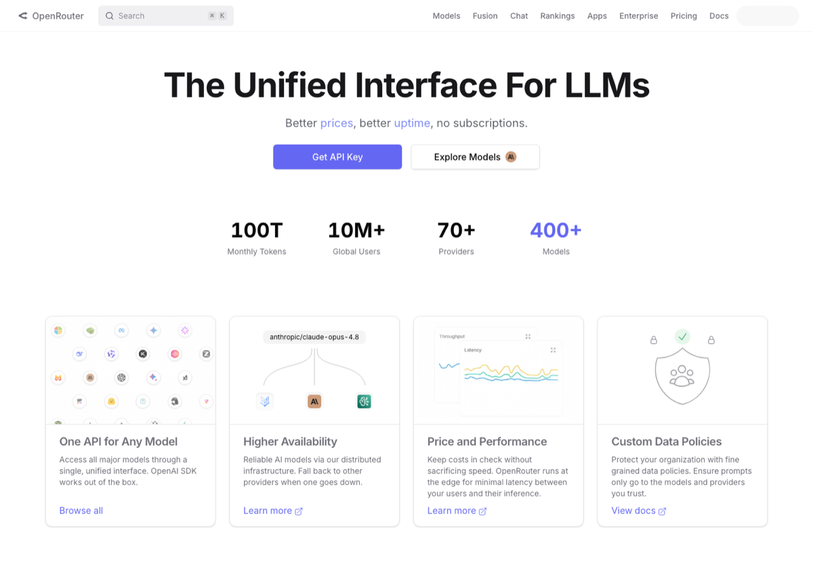

# LLM API 与模型平台入口

> 整理常用大模型 API 平台、聚合平台和模型托管入口，方便快速比较模型、文档、控制台和定价入口。

  
  
  

图片来源：公开入口预览图，[https://openrouter.ai/](https://openrouter.ai/)，截取/整理日期：2026-07-02。

## 定位

本仓库是一份面向中文用户的主题索引，重点整理常用、稳定、值得优先了解的工具入口，并补充适用场景、选型建议和风险边界。目标不是追求数量，而是降低第一次检索和筛选的成本。

- **主题**：AI / API
- **适合人群**：做 AI 应用、机器人、Agent、论文实验的人
- **首批重点**：OpenAI Platform / Anthropic Console / Google AI Studio / DeepSeek Platform / 阿里云百炼 DashScope
- **为什么值得整理**：LLM 应用开发最容易卡在账号、额度、模型入口和文档分散，这种导航页天然适合收藏。

## 使用方式

1. 先看 [精选资源](#精选资源)，按自己的场景挑 2-3 个入口试用。
2. 再看 [选型建议](#选型建议)，避免一上来把同类工具全装一遍。
3. 如果用于课程、论文、开源项目或生产环境，务必看 [风险提醒](#风险提醒)。

## 收录口径

只收模型调用相关入口：官方平台、聚合平台、托管平台和统一调用层。

优先收录：

- 官方文档、官网、活跃 GitHub 仓库；
- 免费可试用或开源项目；
- 中文用户高频搜索、收藏、复用的工具；
- 入口稳定、说明清楚、维护状态可判断的资源。

暂不收录：

- 破解软件、灰色下载、账号代认证、返利推广；
- 长期不可访问或入口频繁变化的镜像；
- 只有营销话术、没有清晰文档的产品；
- 与本主题关系很弱的泛泛工具。

## 精选资源

| 名称 | 适合场景 | 入口 |
| --- | --- | --- |
| OpenAI Platform | OpenAI API 文档和控制台入口。 | [访问](https://platform.openai.com/docs/overview) |
| Anthropic Console | Claude API 控制台入口。 | [访问](https://console.anthropic.com/) |
| Google AI Studio | Gemini API 原型和 key 管理入口。 | [访问](https://aistudio.google.com/) |
| DeepSeek Platform | DeepSeek API 平台入口。 | [访问](https://platform.deepseek.com/) |
| 阿里云百炼 DashScope | 通义千问等模型调用与应用开发平台。 | [访问](https://bailian.console.aliyun.com/) |
| OpenRouter | 多模型聚合平台，适合快速切换 provider。 | [访问](https://openrouter.ai/) |
| Hugging Face Models | 模型权重、demo、社区模型搜索入口。 | [访问](https://huggingface.co/models) |
| Replicate | 托管模型 API 和 demo 平台。 | [访问](https://replicate.com/) |
| GroqCloud | 高速推理 API 控制台。 | [访问](https://console.groq.com/) |
| Together AI | 开源模型托管和推理平台。 | [访问](https://www.together.ai/) |
| Fireworks AI | 模型推理和 fine-tuning 平台。 | [访问](https://fireworks.ai/) |
| SiliconFlow | 中文用户常用模型 API 平台。 | [访问](https://siliconflow.cn/) |
| CoderPlan | 面向国内开发者的多模型 API 中转，OpenAI 兼容，按量付费。 | [访问](https://coderplan.ai) |
| LiteLLM | 统一多模型 API 调用层。 | [访问](https://github.com/BerriAI/litellm) |

## 选型建议

- 先确定模型用途：文本、代码、视觉、语音或 embedding。
- 把控制台、定价页、API 文档一起收藏。
- 先写最小 demo，再接入生产。

## 风险提醒

- 优先确认地区、支付方式、速率限制和账单策略。
- 生产场景需评估聚合平台的稳定性、隐私边界和服务可用性。

## 维护说明

- 本仓库会优先更新失效链接、官方入口变更和明显过时的描述。
- 新增资源请尽量给出官网、GitHub 仓库、文档页或可验证的公开说明。
- 推荐新资源时，请说明具体场景和选择理由，避免只写泛泛评价。

## 数据文件

结构化数据见 [`data/links.json`](data/links.json)，可用于脚本生成网页、表格或个人导航页。

## Contributing

欢迎提交 PR 修正链接、补充官方文档、更新截图或改进中文说明。请保持描述短、准、可验证。

## License

MIT。第三方商标、截图、网页内容和产品名称归各自权利方所有，本仓库只做索引和学习整理。
